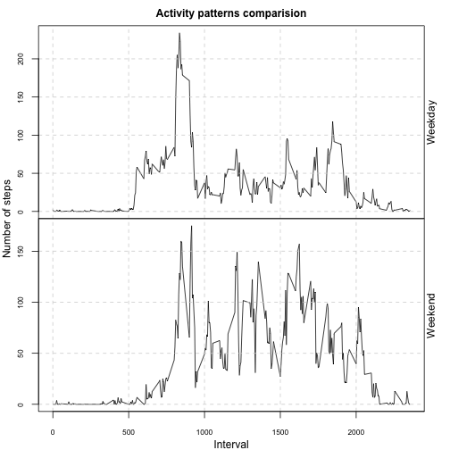
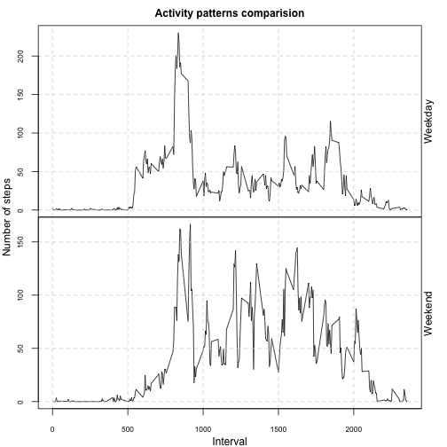

# Reproducible Research: Peer Assessment 1


## Loading and preprocessing the data


```r
data <- read.csv(unz("activity.zip", "activity.csv"))
data <- transform(data, date = as.Date(date, "%Y-%m-%d"))
```

## What is mean total number of steps taken per day?

```r
good <- data[complete.cases(data$steps), ]
subdate <- split(good, good$date)
total_step_per_day <- sapply(subdate, function(x){
        sum(x$steps)
})
par(mfrow=c(1,1))
hist(total_step_per_day, main="Histogram of total number of steps taken each day", xlab="steps")
```

 

```r
mean_step <- mean(total_step_per_day)
median_step <- median(total_step_per_day)
```

### Use tapply will be fairly easy

```r
ave.all <- tapply(data$steps, data$interval, mean, na.rm = T)
head(ave.all)
```

```
##       0       5      10      15      20      25 
## 1.71698 0.33962 0.13208 0.15094 0.07547 2.09434
```

* The mean of steps taken each day is 1.0766 &times; 10<sup>4</sup>.
* The median of steps taken each day is 10765.

## What is the average daily activity pattern?

```r
subinterval <- split(good, good$interval)
ave_step_allday <- sapply(subinterval, function(x){
        mean(x$steps)
})
par(mfrow=c(1,1))
plot(unique(good$interval), ave_step_allday, type="l", xlab="5-minute interval", ylab="average number of steps", main = "Average daily activity pattern")
```

 

```r
max_interval <- max(ave_step_allday)
```

* The 5-minute interval that, on average, contains the maximum number of steps is 206.1698.


## Imputing missing values
The strategy for imputing missing data is: 
Using for loop to traverse the dataset, when encounter the "NA", incert the mean for that 5-minute interval as its steps.

### Do not use for loop, so slow!

```r
total_NA <- nrow(data) - nrow(good)
new_data <- data.frame()
for (i in 1:nrow(good)){
        temp_row <- good[i, ]
        if(is.na(temp_row$steps)){
                temp_interval <- temp_row$interval/5 + 1
               temp_step <- ave_step_allday[temp_interval]
               temp_row$steps <- temp_step
        }
        new_data <- rbind(new_data, temp_row)     
}
```

### Use merge and assign instead

```r
new_data <- data
tf.step <- is.na(new_data$steps)
na.step <- data[tf.step, c("steps", "interval")]
na.step$row <- as.integer(rownames(na.step))

interval <- as.integer(unlist(labels(ave_step_allday)))
ave.df <- as.data.frame(cbind(ave_step_allday, interval))

merged <- merge(na.step, ave.df, all.x = T, by = "interval")

order <- merged[order(merged$row), ]

new_data$steps[tf.step] <- order$ave_step_allday
```


```r
new_total_step_per_day <- tapply(new_data$steps, new_data$date, sum)
par(mfrow=c(1,1))
hist(new_total_step_per_day, main="Histogram of new total number of steps taken each day", xlab="steps")
```

 

```r
new_mean_step <- mean(new_total_step_per_day)
new_median_step <- median(new_total_step_per_day)
```

After inputting the missing value:

* The mean of steps taken each day is 1.0766 &times; 10<sup>4</sup>.

* The median of steps taken each day is 1.0766 &times; 10<sup>4</sup>.

## Are there differences in activity patterns between weekdays and weekends?

```r
new_data$weektime <- as.factor(ifelse(weekdays(new_data$date) %in% c("Saturday","Sunday"),"weekend", "weekday"))
library(lattice)
all.ave <- merge(new_data, ave.df, all.x = T, by = "interval")

week.ave <- tapply(all.ave$steps, list(all.ave$interval, all.ave$weektime), mean)
week.ave <- as.data.frame(week.ave)
week.ave$interval <- rownames(week.ave)
```


```r
par(mfrow=c(2,1), mar=c(0,0,0,0), oma = c(3, 3, 2, 2))
plot(week.ave$interval, week.ave$weekday, type="l", axes=F)
grid(NULL,NULL, lty=2)
box("plot")
mtext("Weekday", side=4, line=0)
axis(2, at=seq(0,200,50), cex.axis=0.7,)
plot(week.ave$interval, week.ave$weekend, type="l", axes=F)
mtext("Weekend", side=4, line=0)
axis(2, at=seq(0,200,50), cex.axis=0.7)
axis(1, at=seq(0,2500,500), cex.axis=0.7)
grid(NULL,NULL, lty=2)
box()
mtext("Activity patterns comparision", side=3, outer=T, font=2, line=0.5)
mtext("Interval", side =1, outer = T, line=2)
mtext("Number of steps", side = 2, outer=T, line=2)
```

 
